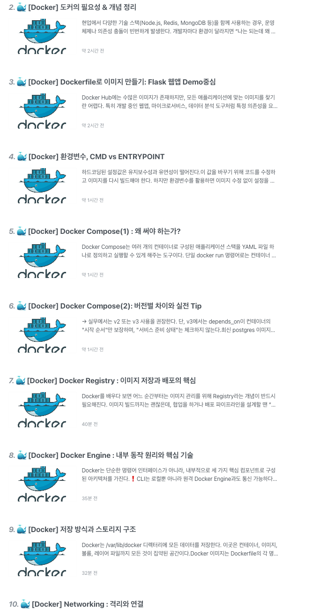

# 진행사항

- [x]  기술 블로그 포스트
- [x]  Docker 강의 완강
- [ ]  실습을 통한 체화

# ✅ 요약본

## 1. Dockerfile로부터 시작된 컨테이너

Docker의 핵심은 애플리케이션을 컨테이너에 가볍게 패키징할 수 있다는 점이다. 이 패키징을 위한 스크립트가`Dockerfile`이다. Docker를 처음 접하고 느꼈던 점은, 몇 줄의 명령어만으로 운영체제, 패키지, 앱 코드, 실행 명령까지 모두 포함된 이미지를 만들 수 있다는 것이었다. DevOps를 잘 몰라도 매우 좋아보인다는 것은 알았다.

```

FROM ubuntu
RUN apt-get update && apt-get install -y python3-pip
COPY ./app.py /opt/app.py
RUN pip3 install flask
ENTRYPOINT ["python3", "/opt/app.py"]

```

위 `Dockerfile`은 Ubuntu 이미지를 기반으로 Python과 Flask를 설치하고, 앱을 실행하도록 설정한 예시이다. `docker build` 명령어로 이미지를 만들고, `docker run`으로 실행하면 즉시 컨테이너화된 앱이 작동하는 구조이다.

---

## 2. Docker 이미지의 계층 구조와 캐싱

Docker 이미지는 **레이어 기반 구조**로 되어 있다. 각 Dockerfile 명령어는 하나의 레이어로 저장되며, 캐시를 활용하여 이미지 빌드 속도를 최적화한다. 예를 들어, `RUN apt-get update` 단계 이후 변경이 없다면 Docker는 해당 레이어를 재활용하게 된다.

이런 구조 덕분에 변경된 코드만 반영한 이미지를 빠르게 재생성할 수 있으며, 여러 이미지 간 동일한 레이어를 공유해 디스크 공간도 효율적으로 사용된다.

---

## 3. 컨테이너와 저장소

처음 컨테이너를 실행하고 데이터를 저장했을 때, 컨테이너를 삭제하자마자 모든 데이터가 사라지는데, 이를 보완할 방법을 알게 되었다. 그렇게 학습한 개념이 Docker의 **Volume**이다.

### 컨테이너 데이터 저장 방식

- **Volume**: Docker에서 관리하는 데이터 저장소로, 컨테이너 삭제 후에도 데이터가 유지된다.
- **Bind Mount**: 호스트의 디렉토리를 직접 마운트하는 방식으로, 테스트 환경에서 유용하다.
- **-mount**: 더 명시적이고 유연한 최신 방식이다.

```bash

docker volume create mydata
docker run -v mydata:/data my-app

```

이후 `/var/lib/docker/volumes/mydata/_data` 경로에 실제 데이터가 저장된다. 실무에서도 DB 컨테이너나 Jenkins 등의 설정 보존 시 필수로 사용된다.

---

## 4. Docker Networking의 동작 방식

Docker는 설치만 하면 세 가지 기본 네트워크를 자동으로 생성한다: `bridge`, `host`, `none`. 기본적으로 컨테이너는 `bridge` 네트워크에 연결되며, 내부 IP를 통해 서로 통신한다.

**Docker는 편리하게도 컨테이너 이름으로도 통신이 가능하다.** Docker는 내부에 내장 `127.0.0.11` DNS 서버를 두어 컨테이너 이름을 자동으로 IP로 매핑해준다.

또한 `docker network create` 명령어를 통해 사용자 정의 네트워크를 만들 수 있으며, `subnet`까지 세세하게 조절할 수 있다는 점도 굉장히 유용하다.

---

## 5. Docker Registry: 이미지 저장소

이미지 빌드 후 로컬에만 저장할 수 있다면 협업이나 배포가 불가능하다. 그래서 Docker는 Registry라는 개념을 도입했다.

- 기본 Registry는 **Docker Hub**
- 프라이빗 Registry는 AWS, ECR, GCP Artifact Registry, Azure ACR 등이 있다

```bash

docker tag my-app username/my-app
docker push username/my-app

```

개인적으로 직접 구축한 로컬 Registry도 있다. 아래처럼 `registry:2` 이미지를 사용하면 로컬에서 작동하는 Registry를 만들 수 있다.

```bash

docker run -d -p 5000:5000 --name my-registry registry:2

```

---

## 6. Docker 내부 동작 원리: Namespace와 Cgroups

처음엔 컨테이너가 VM가 어떻게 다르게 동작한다는 것인지 체감이 쉽지 않았다. 여기서 Docker는 리눅스의 **Namespace**와 **Cgroups**를 활용해 프로세스를 격리하고 자원을 제한하는 구조라는 것을 학습하였다.

- **Namespace**는 PID, Network, Mount 등의 격리를 제공
    - 컨테이너 내부 PID는 항상 1부터 시작한다
- **Cgroups**는 CPU, 메모리 등 리소스 사용량을 제한한다

```bash

docker run --cpus="0.5" --memory="200m" my-app

```

이 구조 덕분에 컨테이너는 가볍고 빠르며, 수백 개도 동시에 실행 가능하다.

---

## 7. 오케스트레이션

단일 컨테이너만 다룰 때는 `docker run`으로도 충분하다. 하지만 서비스가 커지고 컨테이너가 수십, 수백 개가 되면 수동 관리는 불가능하다. 이때 필요한 것이 **오케스트레이션**이다.

오케스트레이션은 컨테이너의 배포, 확장, 자동 복구, 로드밸런싱을 자동으로 수행해주는 시스템이다.

---

## 8. Docker Swarm: Docker가 제공하는 오케스트레이터

Swarm은 Docker에서 직접 제공하는 오케스트레이션 도구이다. 설치가 간편하고 Docker CLI와의 통합도 뛰어나다.

```bash

# 클러스터 초기화
docker swarm init

# Worker 노드 참여
docker swarm join --token <TOKEN> <MANAGER_IP>:2377

# 서비스 생성
docker service create --name web --replicas 3 -p 80:80 nginx

```

`docker service` 명령어 하나로 다수의 노드에 컨테이너가 분산 배포되고, 장애가 발생하면 자동으로 복구된다. 로드밸런싱도 자동이다.

---

## 9. Kubernetes

Kubernetes는 현재 가장 널리 쓰이는 오케스트레이션 도구이다. 클라우드와의 연동, 다양한 기능 확장성, 롤링 업데이트, 상태 기반 관리 등에서 Docker Swarm보다 훨씬 강력하다.

- 클러스터는 여러 노드로 구성되며, Pod 단위로 컨테이너가 관리된다
- 각 노드는 `kubelet` 에이전트로 제어되며, 마스터 노드에는 API 서버, 스케줄러, 컨트롤러, etcd가 작동한다

대표 명령어는 다음과 같다.

```bash

kubectl apply -f deployment.yaml      # 리소스 생성
kubectl get pods                      # 실행 중인 pod 확인
kubectl scale deployment web --replicas=5

```

입문장벽이 높은 편이지만, DevOps나 MSA 환경에선 Kubernetes가 표준으로 받아들여지고 있다.

→ 이제 공부할 예정